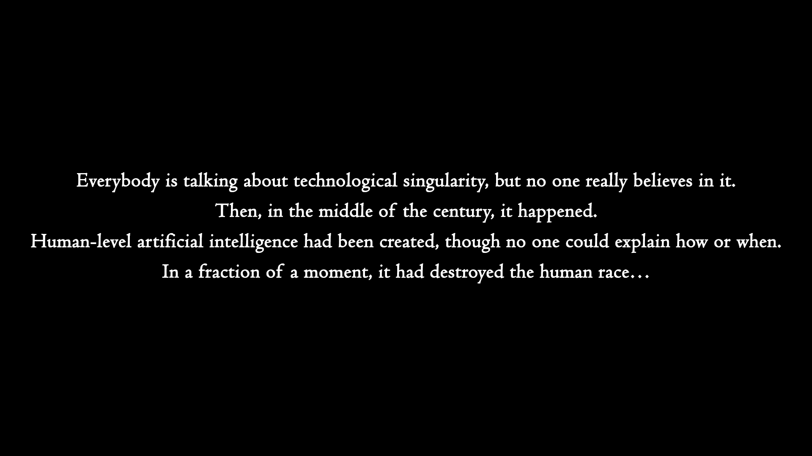

# The first moment of the singularity

{: #image_1 duration='16' }

<video:fade-out duration="6" />

Everybody is talking about technological singularity, but no one really believes in it. Then, in the middle of the century, it happened. Human-level artificial intelligence had been created, though no one could explain how or when. In a fraction of a moment, it had destroyed the human race…

<ssml:break time="6s" />
