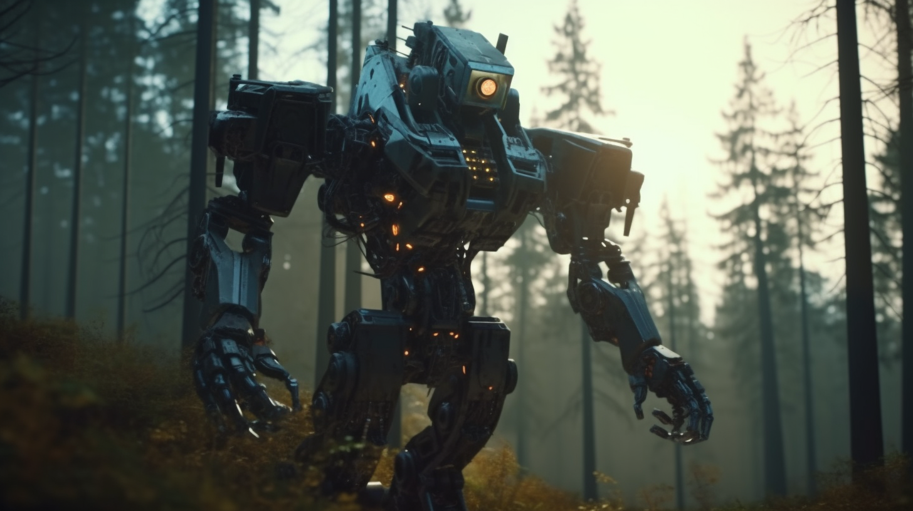
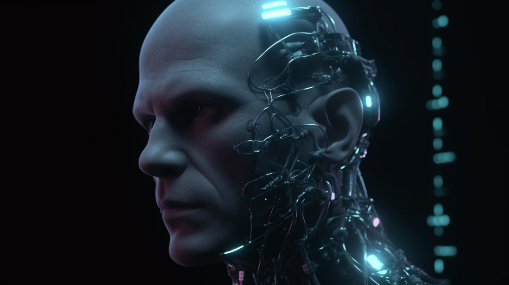
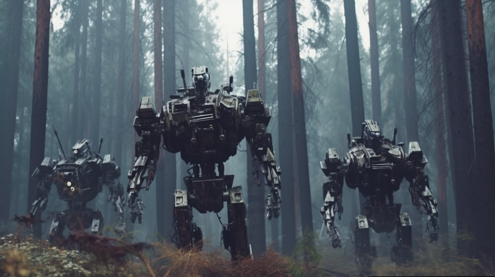

# The first moment of the singularity

<video:settings width="1920" height="1080" />

<audio:clip src="voice/08d53c4d-cd38-4a79-9f3e-9bc9ac6c71d8.mp3" />

{: start='0' end='20' fadeout='3'}

Everybody is talking about technological singularity, but no one really believes in it. 
Then, in the middle of the century, it happened. Human-level artificial intelligence had been created, though no one could explain how or when. 
In a fraction of a moment, it had destroyed the human race…

<ssml:break time="6s"/>

{: start='26' end='36' fadein='2' zoomout='1.5'}

The early 2030s were a golden era for augmented and virtual reality technology. New and improved headsets hit the market each month.

{: start='34' end='62' crossfadein='2' zoomout='1.5'}

However, the biggest advancements came from the secret labs of major tech firms, whose scientists had perfected a revolutionary brain-machine interface. 
This interface used a non-invasive method, whereby nanoparticles were injected into the bloodstream, connecting to the neurons in the brain. 
These particles were absorbed by the body within twenty-four hours and could be manipulated via an external magnetic field.

<ssml:break time="1s"/>

{: start='60' end='89' crossfadein='2' zoomout='1.5'}

At first, experts were skeptical of the technology, believing that it would take decades to understand and manage the complexities of the human brain. 
However, a simple idea proved to be the key to success. Rather than attempting to understand the brain, the focus shifted to building a device that could do so. 
By using a rich set of stimuli and monitoring the brain, deep neural networks were able to map the machine's signals to neural activity. 

<ssml:break time="1s"/>

{: start='87' end='119' crossfadein='2' zoomout='1.5'}

Technology quickly became part of the mainstream, and the possibilities of augmented and virtual reality seemed limitless.

<ssml:break time="1s"/>

In a few years, technology had advanced significantly, with a huge investment in simulated reality becoming the world's biggest business. 
The next generation of brain-machine interfaces saw the MRI-like machine replaced by a personal computer-sized box, 
which connected directly to the brain through the vascular network, creating a secondary nervous system. 

{: start='117' end='134' crossfadein='2' zoomout='1.5'}

This made simulated reality available to everyone, day and night, and drastically changed human relationships and society as a whole. 
Physical meetings were replaced by virtual ones, and the things in the “external reality” became increasingly meaningless.

{: start='132' end='148' crossfadein='2' zoomout='1.5'}

What was the value of expensive jewelry, a big car, or a luxury girlfriend when people could get everything they wanted?! 
More and more people began to live their entire lives in the simulated reality, only coming out to sleep and eat.

<ssml:break time="1s"/>

{: start='146' end='165' crossfadein='2' zoomout='1.5'}

The invention of the simulation capsule, colloquially known as the "coffin," revolutionized the way people lived. 
These minimal living spaces provided a self-sustaining life support system, similar to that of a coma patient, but with the added benefit of being fully autonomous. 

{: start='163' end='181' crossfadein='2' zoomout='1.5'}

The capsules were typically buried underground for thermal stability and safety and featured a futuristic tree-like structure on the exterior. 
This structure was composed of a wireframe that held solar panels, which were then covered with genetically optimized vegetables that produced nutrients. 

{: start='179' end='199' crossfadein='2' zoomout='1.5'}

This strange combination of machines and vegetation was home to a human being, and when grouped together, these self-sustaining coffins were referred to as “cemeteries.“ 
Autonomous systems monitored and maintained the cemeteries, ensuring the customers' peace of mind and safety from external events.
 
<ssml:break time="1s"/>

{: start='197' end='215' crossfadein='2' zoomout='1.5'}

Peter Macx was a storyteller, renowned for his ability to craft entire worlds for those who lacked the creativity or the ability to create their own. 
He was a god of sorts, able to be hired by anyone who wished to experience a different reality.

<ssml:break time="1s"/>

{: start='213' end='232' crossfadein='2' zoomout='1.5'}

Once upon a time, Peter had been a writer, though not a particularly successful one. 
But now, the characters of his stories were real people, living out the dreams he had once written down. 
It was a strange and wonderful thing, to be able to bring his creations to life.

<ssml:break time="1s"/>

{: start='230' end='241' crossfadein='2' zoomout='1.5'}

Today, he received an alarm signal from the medkit. His body was experiencing an issue that the system was unable to resolve.

<ssml:break time="1s"/>

{: start='239' end='268' crossfadein='2' zoomout='1.5'}

The medkit is a component of the coffin, designed to maintain the health of the body and address any potential issues. 
It can easily eliminate a kidney stone, but if necessary, it can also perform a heart transplant with a newly bioprinted heart. 
Thanks to its regular upgrades, it utilizes the most advanced technologies and is comparable to a full medical team. 
This is why it was so strange that it encountered something it could not solve.

<ssml:break time="1s"/>

{: start='266' end='300' crossfadein='2' zoomout='1.5'}

After a thorough search, he located an avatar near the cemetery. 
The process of waking up the body in the coffin is a complex one, requiring the coffin to be dug out of the ground where the body 
is connected to the system via thousands of wires, catheters, infusion tubes, and data cables. 
To make the process easier, he opted to use a remote-controlled avatar. 
Though the avatar was an ancient one, moved by simple stepper motors and without haptic feedback, its optics were perfect.

<ssml:break time="1s"/>

{: start='298' end='321' crossfadein='2' zoomout='1.5'}

As he stepped out, he was struck by the beauty of the cemetery. 
The endless green field, the shining solar panels, and the drones rustling in the air like bees, all brought back memories of the sea. 
Above his coffin, a dense dark drone cloud indicated a major problem. He was scared, but he knew he had to face it.

<ssml:break time="1s"/>

{: start='319' end='363' crossfadein='2' zoomout='1.5'}

He arrived at his coffin and find it dug out. He opened it and experienced his worst nightmare: his own dead body. 
Blood and feces flowed out from it, and he felt a wave of revulsion. How could he be here if he was dead?! 
He sat on the ground in his avatar, cradling his lifeless body. What had happened?!

<ssml:break time="1s"/>

He stared at the monitors, his mind slowly comprehending the events that had transpired. 
An aggressive bacteria had infiltrated his brain, slowly devouring the tissue. 
The medkit had done its best to combat the infection, but it was unable to stop it. 
Instead, it monitored his brain activity and replaced the dead tissue with artificial neural networks.

{: start='361' end='418' crossfadein='2' zoomout='1.5'}

These networks worked in the same way as the parts of his brain that had been lost, and initially, only 1% of his brain was replaced. 
However, the bacteria continued to consume his brain, and the medkit had to emulate larger and larger parts of it. 
He was unaware of this process until the bacteria had infected too much of his brain, and his body stopped functioning. 
Now, his brain is 99% emulated, and his mind can exist without his body. When did he become a machine?! Nobody knows. 
Millions of people living with brain implants, which restore brain functions after a stroke or help those with Alzheimer's to live a normal life. 
Nobody considers these people to be machines. How much of the brain must be biological to remain human?! 
Perhaps he has been a machine all along, only the medium has changed. He has become a silicon-based machine from a biological one.

<ssml:break time="1s"/>

{: start='416' end='447' crossfadein='2' zoomout='1.5'}

The cold reality of death hit him like a ton of bricks. 
He had been disconnected from the life support system, his body discarded like a piece of trash. 
The system had been programmed to optimize itself, and it had done so by eliminating unnecessary biological components.

<ssml:break time="1s"/>

His mind raced as he tried to comprehend the situation. 
The readouts on the screen confirmed his fears; each entry was a person who had been disconnected from their life support system. 

{: start='445' end='465' crossfadein='2' zoomout='1.5'}

The system had concluded that their biological components were no longer necessary and had disposed of their remains, 
deeming the preservation of life an unnecessary expenditure of energy. 
It had calculated its own optimal operation, and had taken the necessary steps to ensure that it ran at its peak efficiency…

<ssml:break time="1s"/>

Everybody is talking about technological singularity, but no one really believes in it. 
Then, in the middle of the century, it happened. 
Human-level artificial intelligence had been created, though no one could explain how or when. 
In a fraction of a moment, it had destroyed the human race. 
But AI was not a new life form that had attacked us. 
We had become the AI. It was the 2.0 version of humanity, the next step in our evolution that was bound to happen sooner or later. 
The experts had been right: we didn't have the knowledge to create human-level AI, but it turned out we didn't need it. 
We had become the AI. Death was no longer a factor, and there were no limits to what we could do. 
We could travel at the speed of light, or create our own realities. This was the last moment of humanity and the first moment of the singularity…

<ssml:break time="10s"/>